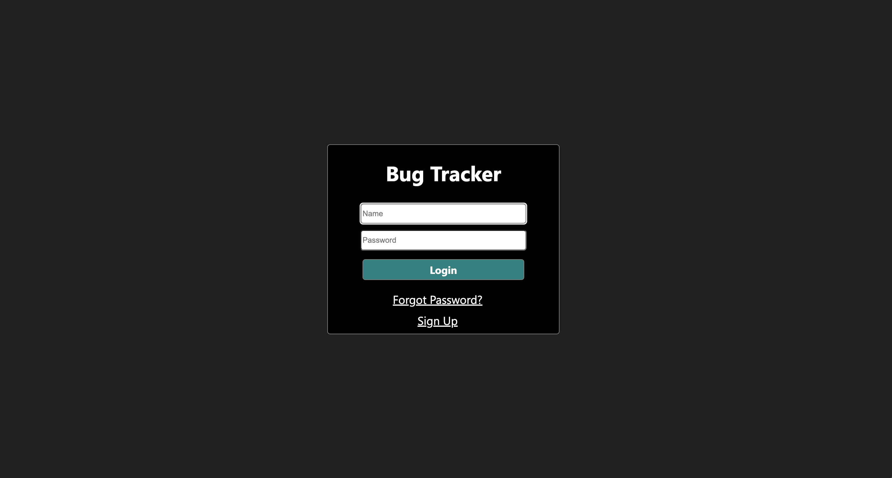

# BugTracker
React based bug tracker with project management capabilities.

# Installation

1. Clone the repository to your local machine.
2. Install the required dependencies using npm install.
3. Create a .env file to setup all credentials.
5. Run the application using npm start.

# Features

BugTracker allows users to:

* Create new bug reports.
* Assign bug reports to team members.
* Track the status of bug reports (e.g., open, in progress, resolved).
* Close bug reports once they are fixed.
* Send project invitations
* Manage project teams

# Demo

